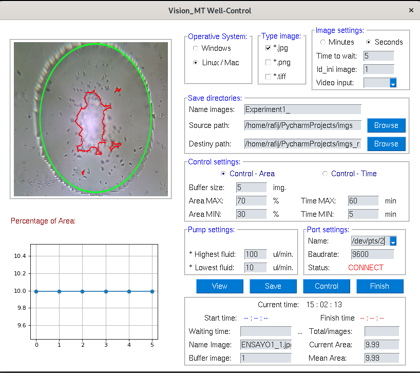

# Vision MT for Control Experiment
Vision MT-Control using **Multi threads** is a GUI Interface programmed in *PYTHON* using PySimpleGUI to control 2 different processes divided in 2 different threads to avoid errors.
* One process is to turn on webcam and save images according to wait time parameter setted by user.
* Another one is to control an external device. In this case a pump used in biological experiments to inject a chemical substance with different speeds and wait time.

## Authomatic Control System
* To inject the substance, this software includes an authomatic algorithm to process a image which is save in a interval of time during the experiment.
* **Perccentage of Area** is the parameter that algorithm computes by image to take a decision to inject high or low flow of fluid.

This is a test version 0.2.1

